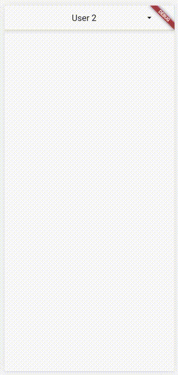

# AppbarDropdown

AppBar Dropdown is an attractive UI element that allows for navigation 
via a dropdown menu in the AppBar.

## Features

* Looks and behaves just like a beautiful AppBar Dropdown menu should
* Configurable
* Works over the top of a WebView




## Usage

`AppbarDropdown` is used by setting it as the value for the `flexibleSpace` property
of your `Scaffold`'s `AppBar`.


```dart
    Scaffold(
        appBar: AppBar(
            flexibleSpace: AppbarDropdown(
                items: [ for (var i=0;i<100;i++) "User $i" ],
                selected: "User 2",
                title: ( (user) => user.toString() ),
                onClick: ( (user) => print(user) ),
            ),
```

### Properties

#### Required

* `items` - An array of any object type
* `title` - A **function** that takes an object of the type in the items array and outputs a string title to display in the list, and in the heading.  (This might look something like `title: ( (p) => (p as MyAppPageObject).pageName )`)

#### Suggested

* `selected` - The initial **default value**, of the same type as the items in the array
* `onClick` - A function that takes the same type of object, and does something with it (eg. change to new app page content, if the objects are page type Widgets)

#### Optional

* `dialogInsetPadding` - Specifies the padding for the dropdown
* `dropdownAppBarColor` - Specifies the colour of the dropdown, including the header


*If additional styling configuration is required, please modify and submit a pull request.*
